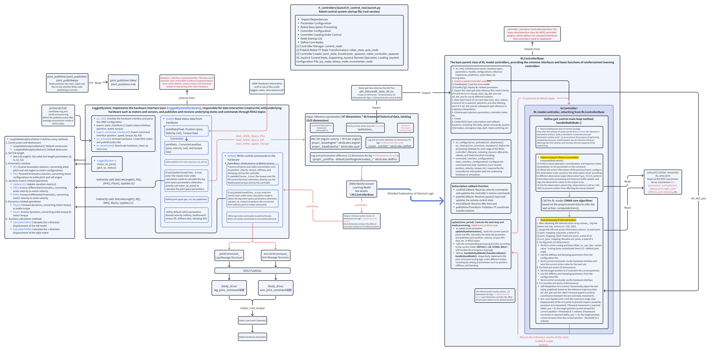

English | [中文](README.zh_CN.md)

# Link U OS Raise A2 Motion Control Program

## I. Basic Content

This project is the Link U OS Raise A2 motion control program, which includes the following content:

```
.
├── deploy              # Motion control program based on ros2_control
├── dockerfile          # Dockerfile for simulation
├── images              # Images used in the documentation
├── joy_interface.py    # Virtual joystick
├── mujoco_sim          # Simulation environment based on aimrt_mujoco_sim
└── README.md           # Documentation
```

## II. Basic Concepts

### 2.1 Motion Control Deployment Logic Diagram

Motion Control Deployment Logic Diagram:


The Motion Control (motion control module) communicates with Hal Ethercat in the real machine, receiving joint status and IMU data from Hal Ethercat. Based on this status information and user commands, it issues joint control instructions. The simulation environment fully simulates the system composed of Hal Ethercat and Robot System, and it can be considered that Mujoco Sim is logically equivalent to Hal Ethercat and Robot System.

### 2.2 Input and Output of the Motion Control Program

The input and output of the motion control program are the following topics, with the corresponding message types listed after the topic names:

```text
/hardware_node
  Subscribers:
    /body_drive/arm_joint_state: joint_msgs/msg/JointState
    /body_drive/leg_joint_state: joint_msgs/msg/JointState
  Publishers:
    /body_drive/arm_joint_command: joint_msgs/msg/JointCommand
    /body_drive/leg_joint_command: joint_msgs/msg/JointCommand
    /imu/data: sensor_msgs/msg/Imu
```

The definitions of each message type are as follows:

```text

# Command
string name
uint32 sequence
float64 position
float64 velocity
float64 effort
float64 stiffness
float64 damping

# JointCommand
std_msgs/Header header
Command[] joints

# State
string name
uint32 sequence
float64 position
float64 velocity
float64 effort
```# JointState
std_msgs/Header header
State[] joints
```

The legs contain a total of 12 motors, with 6 motors on each side. An example `/body_drive/leg_joint_state` message is as follows:

```yaml
header:
  stamp:
    sec: 1756526633
    nanosec: 762130252
  frame_id: joint_sensor_ros2
joints:
- name: idx01_left_hip_roll
  sequence: 0
  position: -0.6994591435362114
  velocity: 3.1219389157225076e-06
  effort: -3.1219389157225077e-07
- name: idx02_left_hip_yaw
  sequence: 0
  position: 1.021779618017926
  velocity: 2.1096323044747747e-05
  effort: -2.1096323044747746e-06
- name: idx03_left_hip_pitch
  sequence: 0
  position: 0.7099361384929567
  velocity: 7.290399425853605e-06
  effort: -7.290399425853605e-07
- name: idx04_left_tarsus
  sequence: 0
  position: 2.446389362978312
  velocity: 8.896056986899126e-06
  effort: -8.896056986899126e-07
- name: idx05_01_left_toe_motorA
  sequence: 0
  position: -1.1065615032732607
  velocity: -8.316770309765935e-06
  effort: 5.86686912690172e-07
- name: idx06_01_left_toe_motorB
  sequence: 0
  position: -0.5794116928724081
  velocity: -3.1840120973271445e-07
  effort: -2.1122058808611103e-07
- name: idx07_right_hip_roll
  sequence: 0
  position: -0.6993730649932512
  velocity: 8.494129383767213e-06
  effort: -8.494129383767213e-07
- name: idx08_right_hip_yaw
  sequence: 0
  position: 1.0350499080249502
  velocity: -7.698829524182571e-05
  effort: 7.698829524182571e-06
- name: idx09_right_hip_pitch
  sequence: 0
  position: 0.017973177108262996
  velocity: -0.00017728934829513307
  effort: 1.7728934829513306e-05
- name: idx10_right_tarsus
  sequence: 0
  position: 2.4439713232317914
  velocity: 6.399217239377904e-06
  effort: -6.399217239377904e-07
- name: idx11_01_right_toe_motorA
  sequence: 0
  position: 0.16303688973865393
  velocity: -2.7883583138982187e-07
  effort: 4.832016369256372e-07
- name: idx12_01_right_toe_motorB
  sequence: 0
  position: -0.3385538673166723
  velocity: 2.6292002537395133e-06
  effort: -7.024233397410617e-07
```

The upper limb contains a total of 14 motors, with 7 motors on each side. An example /body_drive/arm_joint_state message is as follows:

```yaml
header:
  stamp:
    sec: 1756526760
    nanosec: 448124656
  frame_id: joint_sensor_ros2
joints:
- name: idx13_left_arm_joint1
  sequence: 0
  position: -0.010698365355978814
  velocity: 1.1411795337844196e-05
  effort: 10.698365355978813
- name: idx14_left_arm_joint2
  sequence: 0
  position: 1.3508176658559712
  velocity: 5.249694329764141e-06
  effort: -0.8176420141132894
- name: idx15_left_arm_joint3
  sequence: 0
  position: -7.658937311435947e-05
  velocity: -2.0076714132297575e-07
  effort: 0.07658937311435947
- name: idx16_left_arm_joint4
  sequence: 0
  position: 0.0012950086083347687
  velocity: -2.1003841149001136e-06
  effort: -1.2950086083347687
- name: idx17_left_arm_joint5
  sequence: 0
  position: 1.5698844811919535
  velocity: -1.279011126808071e-07
  effort: 0.11557126013394736
- name: idx18_01_left_wrist_rod_A_joint
  sequence: 0
  position: 0.0024414623760019806
  velocity: -6.351086043704432e-08
  effort: -24.414623760019804
- name: idx19_01_left_wrist_rod_B_joint
  sequence: 0
  position: -0.24734669149197516
  velocity: -6.384686202374193e-08
  effort: 2353.5669149197515
- name: idx20_right_arm_joint1
  sequence: 0
  position: 0.008589684501145346
  velocity: -0.0002734100411631197
  effort: -8.589684501145346
- name: idx21_right_arm_joint2
  sequence: 0
  position: -1.350280584663295
  velocity: 0.00012836081788428132
  effort: 0.28056082143712047
- name: idx22_right_arm_joint3
  sequence: 0
  position: 0.0010394089595415334
  velocity: 0.00010391187678237874
  effort: -1.0394089595415335
- name: idx23_right_arm_joint4
  sequence: 0
  position: 0.009214120600879722
  velocity: -0.0002224307845998158
  effort: -9.214120600879722
- name: idx24_right_arm_joint5
  sequence: 0
  position: 1.570995881362803
  velocity: 0.00010691969653657219
  effort: -0.9958289107157725
- name: idx25_01_right_wrist_rod_A_joint
  sequence: 0
  position: 0.0017810096951534735
  velocity: -1.3311292831216607e-05
  effort: -17.810096951534735
- name: idx26_01_right_wrist_rod_B_joint
  sequence: 0
  position: -0.24761239000041307
  velocity: -1.0103359027557954e-05
  effort: 2356.2239000041304
```

Note that the above are the states of each motor. For serial joints, these represent the joint angles, while for parallel joints, the equivalent serial joint states need additional calculations. Taking the ankle parallel mechanism in the following figure as an example, to obtain the angles of the J1 and J2 axes, i.e., the pitch and roll of the foot, general motion control training is usually performed on the equivalent serial joints. The reinforcement learning model inputs and outputs the states and control commands of the serial joints, and an additional serial-parallel conversion is required. The conversion code can be referenced at https://github.com/HuNingHe/closed_loop_ankle (already integrated into the deployment framework).


## 2.3 Motion Control Deployment Framework Logic Analysis

Motion Control deployment framework internal logic diagram:



The Motion Control deployment framework is divided into three main nodes, which are:

1. `legged_system` is responsible for communicating with the hal, and it performs serial-parallel calculations for the ankle mechanism internally.

2. `rl_controller` receives the state of the serial joints and executes the inference of the reinforcement learning model (onnx), outputting the commands for the serial joints.

3. `joy_teleop` is responsible for receiving control commands from the controller and sending corresponding ROS2 topics.

For detailed logic, please refer to the above logic diagram and the source code.

# III. Simulation Operation Tutorial

## 3.1 Environment Requirements

It is recommended to run the simulation environment using Docker. If you need to run the simulation locally, please install the corresponding dependencies according to the contents in dockerfile/Dockerfile. The following tutorial is based on running with Docker.

1. An x86 architecture Linux system computer with Docker installed

   1. Docker installation guide: https://docs.docker.com/engine/install/

   2. Ensure that `docker run hello-world` can be executed successfully.

2. Use an x11 desktop system

   * You can check this by running `echo $XDG_SESSION_TYPE`, and the expected output should be `x11`.

3. The system performance should not be too low, capable of running mujoco simulations smoothly without GPU acceleration.

## 3.2 Image Building

In the deployment repository directory, run the following command:

```bash
docker build -t a2-deploy-image dockerfile/
```

The first run may take a long time, please wait patiently for the image build to complete. The download sources have been replaced with easily accessible sources within China to speed up the download. If a certain step is slow or stuck, try switching the network environment and retry.

If the `docker build` process times out while pulling the base image, you need to configure the image source yourself.

After success, you can execute the following command to check if the image already exists:

```bash
docker images | grep a2-deploy-image
```

## 3.3 Image Startup

First, run the following command on the host machine to allow GUI programs to display the simulation window inside the container:

> Allow Docker to access the display, used to configure the access control list for the X Window System. Executing `xhost +` will allow all hosts to connect to the current user's X server, which disables the X server's access control, allowing any user to access and operate the X server.

```bash
xhost +
```

After entering the deployment repository directory, you can start the image with the following command:

```bash
docker run -it \
  --name=a2_deploy \
  --privileged \
  --net=host \
  --ipc=host \
  --pid=host \
  -e DISPLAY=$DISPLAY \
  -v /dev/input:/dev/input \
  -v /tmp/.X11-unix:/tmp/.X11-unix \
  -v /run/dbus/system_bus_socket:/run/dbus/system_bus_socket:ro \
  -v .:/home/agi/a2_deploy_workspace \
  -d a2-deploy-image
```

If you find that the simulation interface runs slowly on a machine with an NVIDIA graphics card after starting the container with the above command, you can try starting the container with the following command:

```bash
docker run -it \
  --name a2_deploy \
  --gpus all \
  --privileged \
  --net=host \
  --ipc=host \
  --pid=host \
  -e DISPLAY=$DISPLAY \
  -e NVIDIA_VISIBLE_DEVICES=all \
  -e NVIDIA_DRIVER_CAPABILITIES=all \
  -v /dev/input:/dev/input \
  -v /tmp/.X11-unix:/tmp/.X11-unix \
  -v /run/dbus/system_bus_socket:/run/dbus/system_bus_socket:ro \
  -v .:/home/agi/a2_deploy_workspace \
  -d a2-deploy-image
```

## 3.4 Start Simulation, Motion Control, and Virtual Joystick

### 3.4.1 Compile and Start Simulation

```bash
# Enter the docker environment
docker start a2_deploy && docker exec -it a2_deploy /bin/bash

# Build the simulation environment
cd /home/agi/a2_deploy_workspace/mujoco_sim
./build.sh

# Launch the simulation
cd /home/agi/a2_deploy_workspace/mujoco_sim_install/bin
./start_a2_t2d0_ultra.sh
```

After starting correctly, you should see the following interface:


### 3.4.2 Compile and Start Motion Control Framework

```bash
# Enter the docker environment
docker start a2_deploy && docker exec -it a2_deploy /bin/bash

# Compile the motion control framework
cd /home/agi/a2_deploy_workspace/deploy
colcon build

# Run the motion control framework
bash install/deploy_assets/scripts/start_rl_control_sim.sh
```

The interface after successful execution is as follows:


### 3.4.3 Run Virtual Joystick

```bash
# Enter the docker environment
docker start a2_deploy && docker exec -it a2_deploy /bin/bash

# Run the virtual joystick
cd /home/agi/a2_deploy_workspace/deploy
python3 install/deploy_assets/scripts/joy_interface.py
```

After starting the joystick, the interface is as follows:


## 3.5 Remote Control Robot Walking

After the above steps, click "Start Control" -> "Mode Switch" -> "Enter Walk Mode" sequentially on the virtual joystick interface, then click the "Load Key" button on the mujoco interface. The robot will enter the reinforcement learning walking mode, invoking the onnx model for inference control.


To make the robot walk, simply click the "Deadman Button" and then use the mouse to drag the virtual joystick or use the keyboard to control.

# IV. Real Machine Deployment Tutorial

This project's deploy directory can be compiled and packaged, and then OTA updated to the Raise A2 robot along with Link U OS.

## 4.1 Controller Operation Process

Please read the following content carefully to ensure you understand the controller operation logic before running on the real machine. The controller can also be used in the simulation environment, and it is recommended to familiarize yourself with the controller operation logic in the simulation environment before running on the real machine.

<font color="red">Before operating, ensure that the emergency stop button on the controller has sufficient power and can be pressed at any time</font>

1. Press the "start" button on the controller to enter the startup mode
   - The terminal inside the container on the robot should display "start control"
   


2. Press the "LB" and "A" buttons simultaneously on the controller to enter the position control mode
   - The terminal inside the container on the robot should display "lie2stand"
   


<font color="red">At this point, place the robot on the ground, ensuring both feet are on the ground, and support the robot to maintain balance, ensuring the suspension rope is slack</font>

3. Press the "X" button on the controller to enter the motion control mode
   - The terminal inside the container on the robot should display "stand2walk"


<font color="red">At this point, ensure that the emergency stop button on the controller has sufficient power and can be pressed at any time, and confirm that the surrounding environment of the robot is safe</font>

4. Press the "LB" button on the controller to enable the control joystick, and the two joysticks can issue control commands
   - The red arrow corresponds to the forward and backward movement of the joystick
   - The green arrow corresponds to the left and right lateral movement of the joystick
   - The blue arrow corresponds to the left and right turning of the joystick


5. Press the "Y" button (green circle) on the controller, lift the robot, and then press the "start" button (blue circle) on the controller to end the robot control


## 4.2 Handheld Button Logic

1. "start" button: Switches the robot to enter or exit startup mode
	- Startup mode: Position control for each joint, at this time Kp is very small, and the robot should explicitly show that the leg and arm joints are subjected to very little force, they can be moved but with resistance; the terminal in the container on the robot should display "start control"
	- Exit startup mode: At this time, the leg and arm joints of the robot are not subjected to any force, and the terminal displays "stop control"
2. "LB" and "A" buttons: Switches the robot to enter or exit position control mode
	- Enter motion control mode: The robot should explicitly show that the leg and arm joints are subjected to force, they can be slightly moved but with resistance; the terminal in the container on the robot should display "lie2stand"
	- Exit motion control mode: The robot returns to startup mode, and the terminal displays "stand2lie"
3. "X" button: Switches the robot to enter motion control mode
	- The robot can stand autonomously; the terminal in the container on the robot should display "stand2walk"
4. "Y" button: Switches the robot to exit motion control mode
	- The robot returns to position control mode, and the terminal displays "walk2stand"
5. "LB" button: Enables the control joysticks
	- When this button is pressed, the two joysticks on the handheld can issue control commands