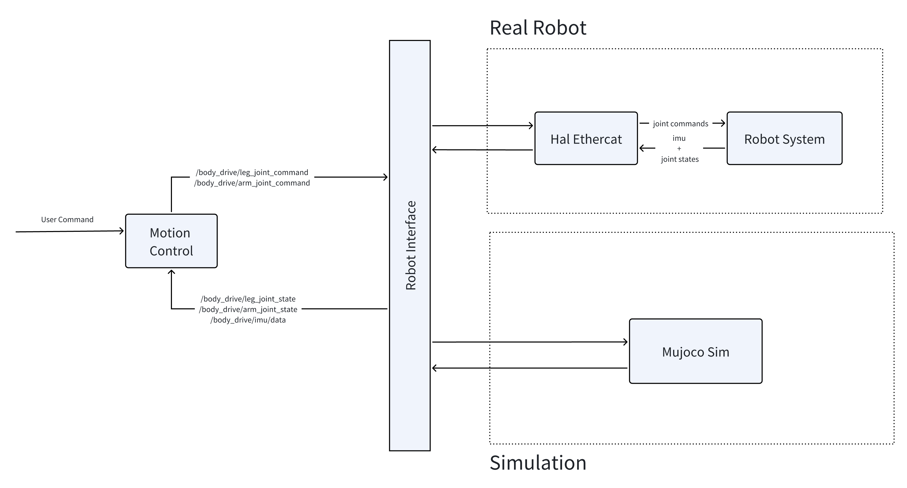
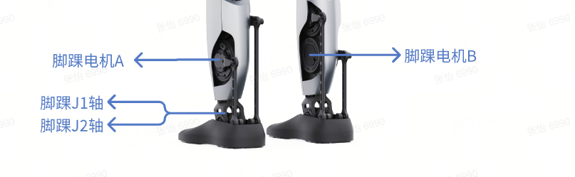
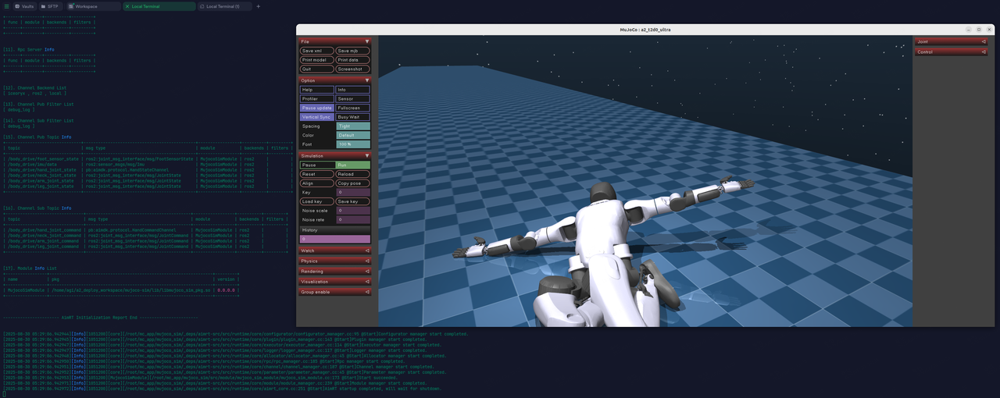
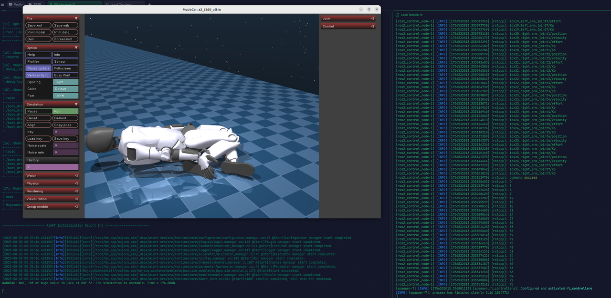
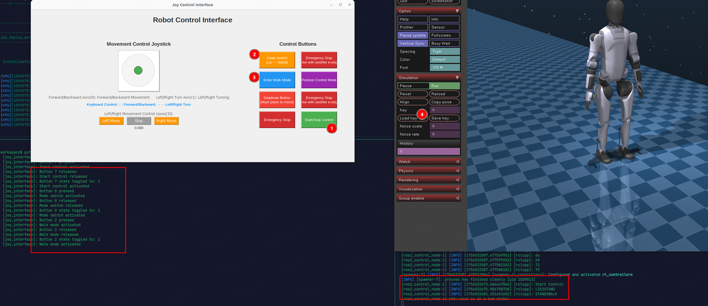
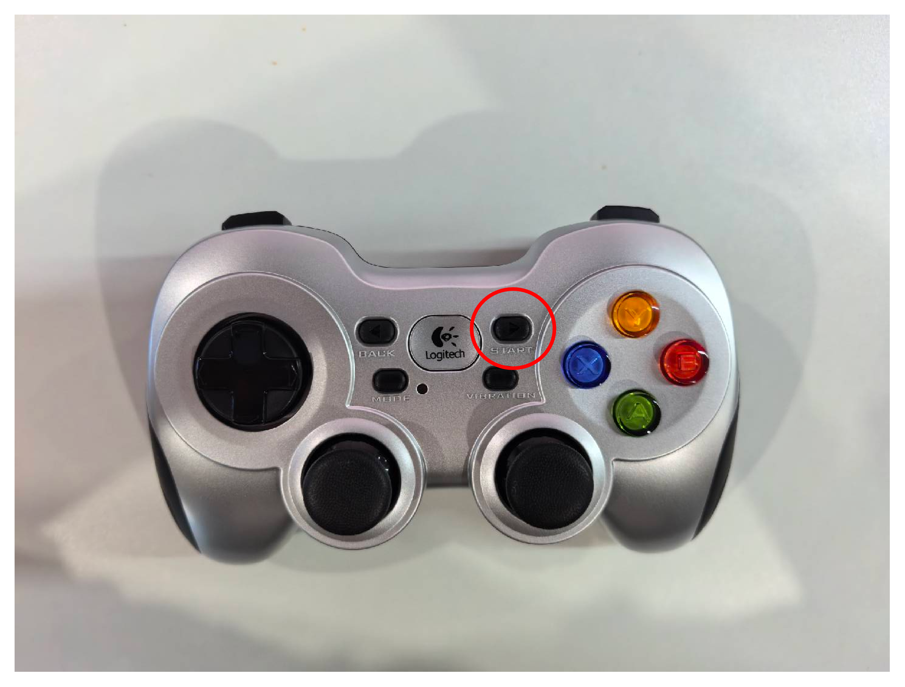
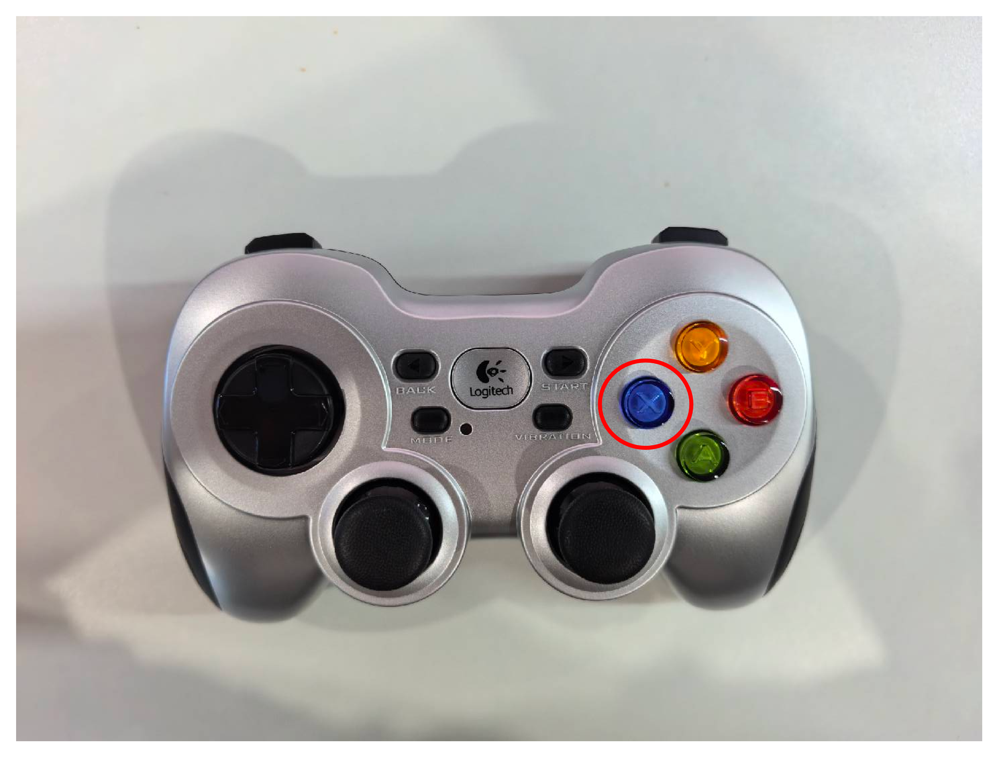
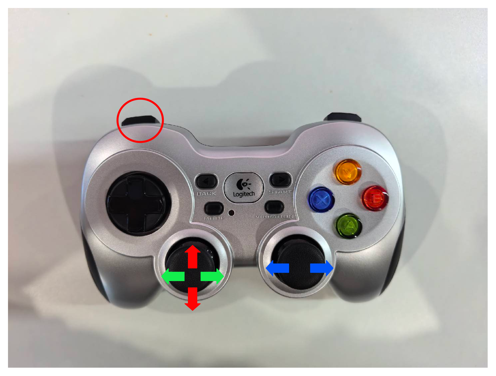
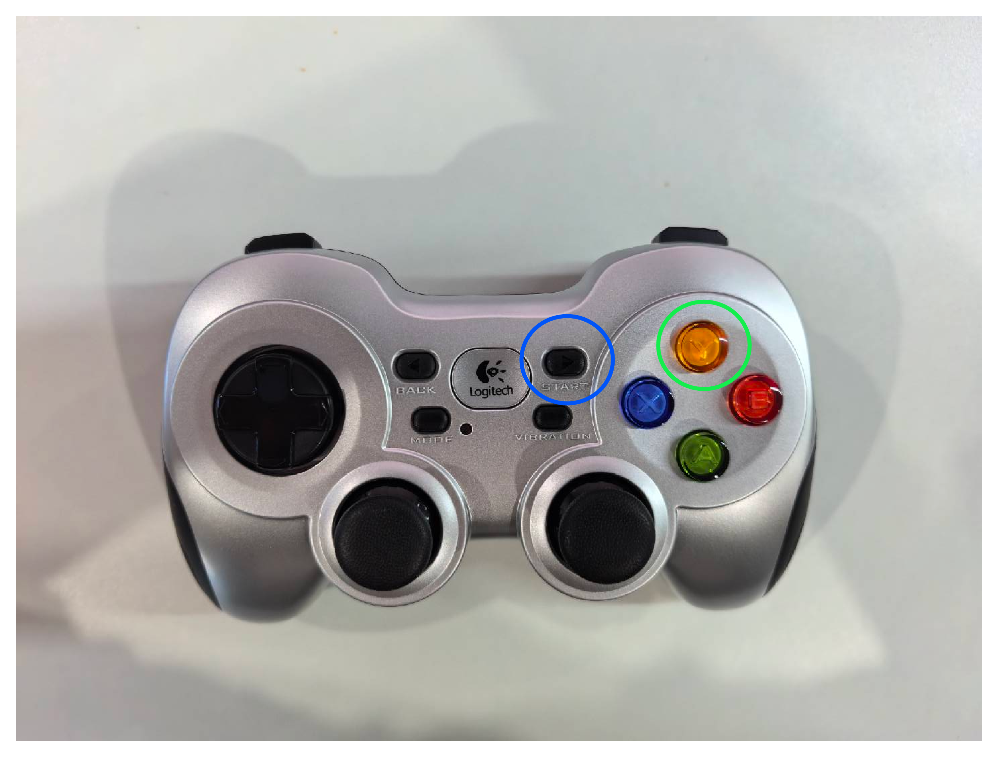

# 灵渠 OS 远征 A2 运动控制程序

## 一、基本内容

本项目为灵渠 OS 远征 A2 运动控制程序，包含以下内容：

```
.
├── deploy              # Motion control program based on ros2_control
├── dockerfile          # Dockerfile for simulation
├── images              # Images used in the documentation
├── joy_interface.py    # Virtual joystick
├── mujoco_sim          # Simulation environment based on aimrt_mujoco_sim
└── README.md           # Documentation
```

## 二、基本概念

### 2.1 运控部署逻辑图

运控部署逻辑图：



Motion Control （运动控制模块）在真机会与 Hal Ethercat 进行通信，接收来自 Hal Ethercat 发来的关节状态和 IMU 数据，根据这些状态信息结合用户指令下发关节控制指令。仿真环境则完全模拟了 Hal Ethercat 和 Robot System 所组成的系统，可以认为 Mujoco Sim 在程序逻辑上完全等价于  Hal Ethercat 和 Robot System。

### 2.2 运控程序输入输出

运动控制程序的输入输出为以下话题，对应消息类型列在话题名后

```text
/hardware_node
  Subscribers:
    /body_drive/arm_joint_state: joint_msgs/msg/JointState
    /body_drive/leg_joint_state: joint_msgs/msg/JointState
  Publishers:
    /body_drive/arm_joint_command: joint_msgs/msg/JointCommand
    /body_drive/leg_joint_command: joint_msgs/msg/JointCommand
    /imu/data: sensor_msgs/msg/Imu
```

其中各个消息类型的定义如下：

```text
# Command
string name
uint32 sequence
float64 position
float64 velocity
float64 effort
float64 stiffness
float64 damping

# JointCommand
std_msgs/Header header
Command[] joints

# State
string name
uint32 sequence
float64 position
float64 velocity
float64 effort

# JointState
std_msgs/Header header
State[] joints
```

其中腿部共包含 12 个电机，单侧 6 个电机，一条示例 `/body_drive/leg_joint_state` 消息如下：

```yaml
header:
  stamp:
    sec: 1756526633
    nanosec: 762130252
  frame_id: joint_sensor_ros2
joints:
- name: idx01_left_hip_roll
  sequence: 0
  position: -0.6994591435362114
  velocity: 3.1219389157225076e-06
  effort: -3.1219389157225077e-07
- name: idx02_left_hip_yaw
  sequence: 0
  position: 1.021779618017926
  velocity: 2.1096323044747747e-05
  effort: -2.1096323044747746e-06
- name: idx03_left_hip_pitch
  sequence: 0
  position: 0.7099361384929567
  velocity: 7.290399425853605e-06
  effort: -7.290399425853605e-07
- name: idx04_left_tarsus
  sequence: 0
  position: 2.446389362978312
  velocity: 8.896056986899126e-06
  effort: -8.896056986899126e-07
- name: idx05_01_left_toe_motorA
  sequence: 0
  position: -1.1065615032732607
  velocity: -8.316770309765935e-06
  effort: 5.86686912690172e-07
- name: idx06_01_left_toe_motorB
  sequence: 0
  position: -0.5794116928724081
  velocity: -3.1840120973271445e-07
  effort: -2.1122058808611103e-07
- name: idx07_right_hip_roll
  sequence: 0
  position: -0.6993730649932512
  velocity: 8.494129383767213e-06
  effort: -8.494129383767213e-07
- name: idx08_right_hip_yaw
  sequence: 0
  position: 1.0350499080249502
  velocity: -7.698829524182571e-05
  effort: 7.698829524182571e-06
- name: idx09_right_hip_pitch
  sequence: 0
  position: 0.017973177108262996
  velocity: -0.00017728934829513307
  effort: 1.7728934829513306e-05
- name: idx10_right_tarsus
  sequence: 0
  position: 2.4439713232317914
  velocity: 6.399217239377904e-06
  effort: -6.399217239377904e-07
- name: idx11_01_right_toe_motorA
  sequence: 0
  position: 0.16303688973865393
  velocity: -2.7883583138982187e-07
  effort: 4.832016369256372e-07
- name: idx12_01_right_toe_motorB
  sequence: 0
  position: -0.3385538673166723
  velocity: 2.6292002537395133e-06
  effort: -7.024233397410617e-07
```

上肢共包含 14 个电机，单侧 7 个电机，一条示例 /body\_drive/arm\_joint\_state 消息如下：

```yaml
header:
  stamp:
    sec: 1756526760
    nanosec: 448124656
  frame_id: joint_sensor_ros2
joints:
- name: idx13_left_arm_joint1
  sequence: 0
  position: -0.010698365355978814
  velocity: 1.1411795337844196e-05
  effort: 10.698365355978813
- name: idx14_left_arm_joint2
  sequence: 0
  position: 1.3508176658559712
  velocity: 5.249694329764141e-06
  effort: -0.8176420141132894
- name: idx15_left_arm_joint3
  sequence: 0
  position: -7.658937311435947e-05
  velocity: -2.0076714132297575e-07
  effort: 0.07658937311435947
- name: idx16_left_arm_joint4
  sequence: 0
  position: 0.0012950086083347687
  velocity: -2.1003841149001136e-06
  effort: -1.2950086083347687
- name: idx17_left_arm_joint5
  sequence: 0
  position: 1.5698844811919535
  velocity: -1.279011126808071e-07
  effort: 0.11557126013394736
- name: idx18_01_left_wrist_rod_A_joint
  sequence: 0
  position: 0.0024414623760019806
  velocity: -6.351086043704432e-08
  effort: -24.414623760019804
- name: idx19_01_left_wrist_rod_B_joint
  sequence: 0
  position: -0.24734669149197516
  velocity: -6.384686202374193e-08
  effort: 2353.5669149197515
- name: idx20_right_arm_joint1
  sequence: 0
  position: 0.008589684501145346
  velocity: -0.0002734100411631197
  effort: -8.589684501145346
- name: idx21_right_arm_joint2
  sequence: 0
  position: -1.350280584663295
  velocity: 0.00012836081788428132
  effort: 0.28056082143712047
- name: idx22_right_arm_joint3
  sequence: 0
  position: 0.0010394089595415334
  velocity: 0.00010391187678237874
  effort: -1.0394089595415335
- name: idx23_right_arm_joint4
  sequence: 0
  position: 0.009214120600879722
  velocity: -0.0002224307845998158
  effort: -9.214120600879722
- name: idx24_right_arm_joint5
  sequence: 0
  position: 1.570995881362803
  velocity: 0.00010691969653657219
  effort: -0.9958289107157725
- name: idx25_01_right_wrist_rod_A_joint
  sequence: 0
  position: 0.0017810096951534735
  velocity: -1.3311292831216607e-05
  effort: -17.810096951534735
- name: idx26_01_right_wrist_rod_B_joint
  sequence: 0
  position: -0.24761239000041307
  velocity: -1.0103359027557954e-05
  effort: 2356.2239000041304
```

注意以上都是各个电机的状态，对于串联关节来说，即为关节角度，而对于并联关节来说，其等效的串联关节状态还需要进行额外计算。以下图的脚踝并联机构为例，要想得到 J1，J2 轴的角度，即脚掌的 pitch 和 roll，一般运控训练都会对等效串联关节进行训练，强化学习模型输入输出的为串联关节的状态和控制命令，还需进行一次串并联解算，解算代码可以参考 https://github.com/HuNingHe/closed\_loop\_ankle（已被集成到部署框架内部）。



## 2.3 运控部署框架逻辑解析

Motion Control 部署框架内部逻辑图：


运控部署框架分为三个主要节点，分别为

1. legged\_system 负责与 hal 进行通信，内部会进行脚踝机构串并联解算

2. rl\_controller 接收串联关节状态并执行强化学习模型（onnx）的推理，输出串联关节指令

3. joy\_teleop 负责接收来自手柄的控制指令并发送对应 ROS2 话题

详细逻辑请自行阅读上述逻辑图以及源代码。

# 三、仿真运行教程

## 3.1 环境要求

推荐使用 docker 方式运行仿真环境，如需本地运行仿真，请仿照 dockerfile/Dockerfile 中的内容自行安装对应依赖等。以下教程均基于 docker 方式运行。

1. 安装有 docker 的 x86 架构 linux 系统电脑

   1. docker 安装教程：https://docs.docker.com/engine/install/

   2. 确保可以正常运行 `docker run hello-world`

2. 使用 x11 桌面系统

   * 可以通过 `echo $XDG_SESSION_TYPE` 来检测，输出 x11 为期望现象

3. 系统性能不太低，可流畅运行 mujoco 仿真，无需 GPU 加速

## 3.2 镜像构建

在部署仓库目录下，运行如下指令：

```bash
docker build -t a2-deploy-image dockerfile/
```

初次运行时间较长，请耐心等待镜像构建完成，其中已尽量将下载源替换为中国境内易访问源以加速下载，如遇某步骤下载缓慢甚至卡死请尝试切换网络环境后重试。

若 docker build 过程拉取基础镜像超时，需自行配置镜像源。

成功后可执行以下命令检查镜像是否已经存在

```bash
docker images | grep a2-deploy-image
```

## 3.3 镜像启动

首先在宿主机上运行以下命令，使得容器内可以运行 GUI 程序显示仿真窗口

> 允许docker访问显示器，用于配置 X Window System 的访问控制列表。执行 xhost + 会允许所有的主机连接到当前用户的 X 服务器，这样做会取消 X 服务器的访问控制，从而允许任何用户访问和操作 X 服务器。

```bash
xhost +
```

进入部署仓库目录后，可以通过如下命令启动镜像：

```bash
docker run -it \
  --name=a2_deploy \
  --privileged \
  --net=host \
  --ipc=host \
  --pid=host \
  -e DISPLAY=$DISPLAY \
  -v /tmp/.X11-unix:/tmp/.X11-unix \
  -v /run/dbus/system_bus_socket:/run/dbus/system_bus_socket:ro \
  -v .:/home/agi/a2_deploy_workspace \
  -d a2-deploy-image
```

如果发现使用 NVIDIA 显卡的机器使用上述命令开启容器后仿真界面运行卡顿，可以尝试使用以下命令开启容器：

```bash
docker run -it \
  --name a2_deploy \
  --gpus all \
  --privileged \
  --net=host \
  --ipc=host \
  --pid=host \
  -e DISPLAY=$DISPLAY \
  -e NVIDIA_VISIBLE_DEVICES=all \
  -e NVIDIA_DRIVER_CAPABILITIES=all \
  -v /tmp/.X11-unix:/tmp/.X11-unix \
  -v /run/dbus/system_bus_socket:/run/dbus/system_bus_socket:ro \
  -v .:/home/agi/a2_deploy_workspace \
  -d a2-deploy-image
```

## 3.4 启动仿真和运控以及虚拟摇杆

### 3.4.1 编译并启动仿真

```bash
# 进入容器环境
docker start a2_deploy && docker exec -it a2_deploy /bin/bash

# 编译仿真环境
cd /home/agi/a2_deploy_workspace/mujoco_sim
./build.sh

# 启动仿真
cd /home/agi/a2_deploy_workspace/mujoco_sim_install/bin
./start_a2_t2d0_ultra.sh
```

正确启动后应该可以看到如下界面：



### 3.4.2 编译并启动运控框架

```bash
# 进入容器环境
docker start a2_deploy && docker exec -it a2_deploy /bin/bash

# 编译运控框架
cd /home/agi/a2_deploy_workspace/deploy
colcon build

# 运行运控框架
bash install/deploy_assets/scripts/start_rl_control_sim.sh
```

成功运行后的界面如下：



### 3.4.3 运行虚拟摇杆

```bash
# 进入容器环境
docker start a2_deploy && docker exec -it a2_deploy /bin/bash

# 运行虚拟摇杆
cd /home/agi/a2_deploy_workspace
python3 install/deploy_assets/scripts/joy_interface.py
```

摇杆启动后，界面如下：


## 3.5 遥控机器人行走

以上启动后依次点击虚拟摇杆界面 Start Control -> Mode Switch -> Enter Walk Mode，然后点击 mujoco 界面 Load Key 按钮，机器人即进入强化学习行走模式，调用 onnx 模型推理控制。



接下来要让机器人行走，只需点击 Deadman Button，然后用鼠标拖动虚拟摇杆或使用键盘控制。

# 四、实机部署教程

本项目 deploy 目录编译打包后随灵渠 OS 整体 OTA 至远征 A2 机器人即可。

## 4.1 手柄操作流程

请详细阅读以下内容，确保理解手柄操作逻辑后再上实机运行。手柄同样可用于仿真环境，建议在仿真环境熟悉手柄操作逻辑后再上实机运行。

<font color="red">操作前，请确保机器人急停手柄电量充足且可以随时被按下</font>

1. 按下手柄“start”键机器人进入启动模式
	- 机上的容器内终端，应显示“start control”字样
  


2. 同时按下手柄“LB”和“A”键机器人进入位控模式
	- 机上的容器内终端，应显示“lie2stand”字样
  


<font color="red">此时放下机器人，确保机器人双脚落地，搀扶机器人使其保持平衡，确保吊绳松弛</font>

3. 按下手柄“X”键机器人进入运控模式
	- 机上的容器内终端，应显示“stand2walk”字样



<font color="red">此时确保机器人急停手柄电量充足且可以随时被按下，并确认机器人周边环境安全</font>

4. 按下手柄“LB”键使能控制摇杆，两个摇杆可发出控制指令
	- 红色箭头对应摇杆方向控制前进后退
	- 绿色箭头对应摇杆方向控制左右横移
	- 蓝色箭头对应摇杆方向控制左右转向



5. 按下手柄“Y”键(绿色圈出)，吊起机器人后按下手柄“start”键(蓝色圈出)，结束机器人控制



## 4.2 手柄按键逻辑
1. “start”键：切换机器人进入或退出启动模式
	- 启动模式：各关节位控，此时Kp很小，机器人应显性的表现为腿部臂部关节受很小的力，可以被扳动但会感受到阻力；机上的容器内终端，应显示“start control”字样
	- 退出启动模式：此时机器人腿部臂部关节不受力，终端显示“stop control”字样
2. "LB"和“A”键：切换机器人进入或退出位控模式
	- 进入运控模式：机器人应显性的表现为腿部臂部关节受力，可以被小幅度扳动但会感受到阻力；机上的容器内终端，应显示“lie2stand”字样
	- 退出运控模式：机器人回到启动模式，终端显示“stand2lie”字样
3. “X”键：切换机器人进入运控模式
	- 机器人可以自主站立；机上的容器内终端，应显示“stand2walk”字样
4. “Y”键：切换机器人退出运控模式
	- 机器人回到位控模式，终端显示“walk2stand”字样
5. “LB”键：使能控制摇杆
	- 该按键被按下时，手柄的两个摇杆才可以发出控制指令